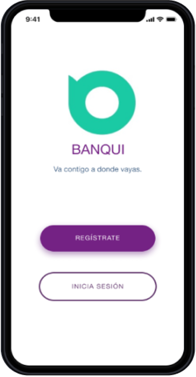

# REDISEÑO DE UNA APLICACION FINANCIERA
Un banco del país, siguiendo las tendencias de otros países, está planeando lanzar un banco 100% digital bajo otro nombre: "Banqui". Su principal objetivo es tener un banco que sea más cercano a las necesidades del público más joven del país. Para ello han venido piloteando [un app](https://marvelapp.com/1hj56576/screen/60926857) con un número pequeño de usuarios. Los resultados de este piloto son mixtos, hay algunas cosas que han sido bien recibidas por los usuarios, y hay otras que se tienen que mejorar aún.

### Los Objetivos Iniciales de la empresa son:
- Aumentar la satisfacción del cliente con los canales digitales para el 2020 y el 2024 app con el mejor servicio.
- Para el 2020 el 70% de las ventas sean por lo canales digitales.
- Diseñar una cultura para que el cliente intuya todas las operaciones que se pueden hacer por el aplicativo.

### Los Objetivos Iniciales del aplicativo son:
- Manejar el rango de usuarios de edades entre 20 años a 55 años.
- Separar por categorías las acciones mas populares en los usuarios.
- Reflejar una relación apegada a la filosofia "banco - persona", no "banco - cuenta"
- Optimizar los pasos de las funcionalidades para hacerlas mas simples y eficaces.
- Tener un aplicativo adaptado al cliente, darle una interface con la que sienta confianza.

## EL RETO
Nuestro objetivo para el proyecto era hacer la aplicación mas simple, las personas ahora esta acostumbradas a hacerlo todo mas rápido y en la comodidad de sus casas, oficnas, autos, etc. La premisa original era simple: tocar un boton y hacer una transacción.

### Nuestros objetivos eran:
1. Que las personas hagan sus operaciones con rapidez y facilidad.
2. Brindar a los usuarios mas control sobre su tiempo y dinero.

### Mi papel
Formé parte de un equipo 3 diseñadoras de experiencia de usuario con Jenny Chavez y Fiorella Alvitez.
Participé en la etapa del research en cuanto a entrevistas, análisis de la data obtenida y correcciones UI.

## KICK OFF

### Entrevistas con usuarios potenciales

Probamos la aplicación Banqui existente con 5 participantes, para saber en estado actual de la aplicación y cuales eras sus falencias. Despues entrevistamos a 8 personas, utilizamos [esta guía de entrevista](https://docs.google.com/document/d/1OmjpdxVTyTIAluoZLuodgpXPq4UolTCOOb1Iwq7s2Xw/edit?usp=sharing); nuestro objetivo era comprender que transacciones realizan con mayor periodicidad, que operaciones se les hacen mas complicadas de realizar, que les gustaria encontrar en una aplicación nueva, por que utilizan una app en vez de ir al banco, por que prefieren ciertos bancos en cuanto a la aplicación.

Realizamos benchmark con aplicaciones similares

Con la información obtenida en las entrevistas, realizamos un [affinity map](https://miro.com/app/board/o9J_kwth0Do=/), donde plasmamos todo los pensamientos, comentarios y posturas de los entrevistados en primera persona para no perder el foco al analizar la información.

Construimos dos user persona, con caracteristicas diferentes, de edades diferentes, una [mujer](imagenes/user-persona1.png) y un [varon](imagenes/user-persona2.png)

Al analizar la información, hicimos un customer journey map, donde visualizamos como se siente el usuario en la operación de pago de servicio.

Posteriormente utilizamos la técnica de los problem statemt's, what if e hicimos una lista de caracteristicas que detallamos en [este documento](https://docs.google.com/document/d/1bgjaGmfWCyPsI1oZZp_itHyLqiwgAeV3g2qI9-4zw3E/edit?usp=sharing).

Despues de toda la información recolectada y analizada identificamos "problemas":

#### Problemas encontrados tanto a nivel de negocio:

- Tanto en las entrevistas como en el testeo que se identificó que algunos flujos de las operaciones no eran eficientes. 
- Al usuario no le gusta ir a otra aplicacion para ver el numero de recibo de los servicios que va a pagar.
- El usuario desea realizar transferencias de manera facil, sin necesidad de saber los 11 digitos de una cuenta.

#### Problemas encontrados tanto a nivel de usuario:

- Habia información que estaba en la vista principal, que no es relevante para el usuario.
- Cuando el usuario hacia un pago se quedaba en duda de si se realizó o no, no tenia una confirmacion del pago.
- El color de algunas palabras era dificil de leer.
- Algunas palabras no se entendian bien.

## Recomendaciones de próximos pasos para el banco con respecto al app

#### General

- Agregar el tipo de monera en los monton mostrados.
- Volver a clasificar las operaciones por categorias y hacerlas denotar mas(separar las transacciones de pago y transferencias)
- Resaltar la funcion de "ahorro", que es muy útil y pocas aplicaciones de la competencia la tienen.
- En el menú o barra de navegacion se recomienda cambiar el ícono de ahorros
- Agregar al menu la opcion de tranferencia.
- Agregar un menú hamburguesa en la parte superior derecha para que pueda entrar a editar su perfil, cerrar sesion, configuraciones.
- Disminuir pasos innecesarios de algunas operaciones en la aplicación

#### Inicio

- Agregar la foto del usuario en la parte superior derecha para que el usuario se sienta identificado con la cuenta.
- Mostrar el color de la tarjeta para que el usuario identifique a cual de sus tarjetas se esta haciendo referencia, en caso de que tenga varias tarejtas.
- Mostrar número de cuenta y el codigo de cuenta interbancario en la vista principal, ya que es información relevante para el usuario, debajo mostrar el saldo disponible que tiene.

#### Ahorros

- Mostar antes de finalizar la operacion, los detalles finales.

#### Pago

- Se recomienda mostrar una vista de confirmacion al finalizar la transacción.
- Se recomienda que el pago servicios de telefonia se haga con el número de celular y no con el numero de recibo.

#### Transferencia

- Se recomienda que la transferencia tambien se pueda hacer a contactos de celular que hayan vinculado su número de cuenta con el numero de celular anteriormente.
- Se recomienda mostrar una vista de confirmacion al finalizar la transacción.

### Prototipo de alta fidelidad

Para los cambios y desarrollos nuevos se realizo un prototipo de alta fidelidad en la herramienta de "invision".
[Aqui](https://dahlia.invisionapp.com/public/share/ERWTRVGA4#/screens/474152308) se va a poder visualizar el flujo de las funciones recomendadas.

<a href="https://dahlia.invisionapp.com/public/share/ERWTRVGA4#/screens/474152308">

	

</a>	

### Carpeta de drive

Para poder ver el proceso de research y diseño puedes ingresar a [esta carpeta](https://drive.google.com/drive/folders/101WzvSmeVsqzmFZGnYo23UDAnjxfpqua?usp=sharing) de drive y encontraras o a [este link](https://www.figma.com/file/yZ05nkaco0oZ54ulskvWMT/App-Banqui?node-id=1%3A13) para ver el prototipo en Figma
- Guia de entrevista a el product owner
- Definición de los user persona
- Videos de test de usuarios en estado actual de aplicación.
- Afinnity map 
- Customer journey map
- Videos de test de usuarios con prototipo rediseñado.
- Slides de presentaciones.

